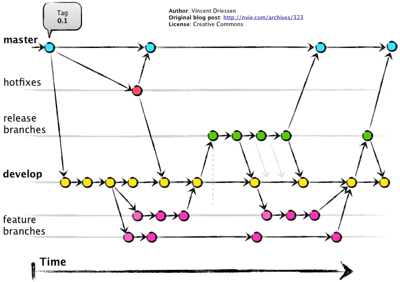

# Git Branch Strategy

이 문서는 템플릿으로 생성되는 실제 프로젝트에서 사용할 Git 브랜치 전략을 정의합니다.

- 기본 전략은 Git-Flow를 프로젝트 상황에 맞게 응용하는 방식입니다.
- `main` 브랜치는 항상 배포 가능한 안정 상태를 유지하고, `dev` 브랜치는 개발 내용이 통합되는 중심 브랜치로 사용합니다.



## Basic Rules

- 모든 작업은 PR 기반으로 병합합니다.
- PR 승인자는 병합 후 작업 브랜치를 삭제합니다.
- 팀 프로젝트에서는 모든 팀원의 approve를 받은 뒤 병합하는 것을 원칙으로 합니다.
- Copilot 또는 AI 자동 리뷰를 함께 사용합니다.
- 기능 개발은 `dev` 브랜치에서 작업 브랜치를 생성해 진행합니다.
- 릴리즈 전에는 `release/*` 브랜치에서 테스트와 코드 리뷰를 진행합니다.
- `main` 브랜치에는 검증된 변경사항만 병합합니다.

## Branch Types

### main

`main` 브랜치는 제품 릴리즈 또는 프로덕션 배포에 사용하는 안정 브랜치입니다.

목적:

- 항상 배포 가능한 상태를 유지합니다.
- 릴리즈가 확정된 코드만 포함합니다.
- 운영 환경에 배포할 기준 브랜치로 사용합니다.

규칙:

- 기능 브랜치를 직접 병합하지 않습니다.
- 일반 개발 작업은 `dev`를 거쳐 반영합니다.
- 긴급 수정은 `hotfix/*` 브랜치를 통해 반영합니다.

### dev

`dev` 브랜치는 개발 내용이 통합되는 중심 브랜치입니다.

목적:

- 여러 기능 브랜치의 작업 결과를 통합합니다.
- 다음 릴리즈 후보를 준비합니다.
- 기능 개발, 리팩토링, 문서 작업의 기본 기준 브랜치로 사용합니다.

규칙:

- `feat/*`, `refactor/*`, `bugfix/*`, `docs/*` 브랜치는 기본적으로 `dev`에서 생성합니다.
- 기능 개발이 완료되면 PR을 통해 `dev`로 병합합니다.
- `dev`는 개발 중인 코드가 모이는 브랜치이므로 일시적으로 불안정할 수 있습니다.

### feat/*

`feat/*` 브랜치는 새로운 기능을 개발할 때 사용합니다.

예시:

```text
feat/login
feat/12-login
feat/payment-api
```

생성 기준:

```text
dev -> feat/* -> dev
```

규칙:

- 하나의 브랜치는 하나의 기능 또는 하나의 이슈를 기준으로 생성합니다.
- 기능 개발이 끝나면 단위 테스트를 수행합니다.
- PR 승인 후 `dev`에 병합하고 브랜치를 삭제합니다.

### release/*

`release/*` 브랜치는 특정 버전의 개발이 완료된 뒤 최종 릴리즈 전 검증을 위해
사용합니다.

예시:

```text
release/1.0.0
release/2026-06-11
```

생성 기준:

```text
dev -> release/* -> main
                 -> dev
```

규칙:

- `dev`에서 생성합니다.
- 릴리즈 전 통합 테스트, 시나리오 테스트, E2E 테스트, 코드 리뷰를 진행합니다.
- 릴리즈가 확정되면 `main`에 병합합니다.
- 릴리즈 중 발생한 수정사항은 `dev`에도 다시 반영합니다.

### hotfix/*

`hotfix/*` 브랜치는 릴리즈 후 운영 환경에서 긴급 버그가 발생했을 때 사용합니다.

예시:

```text
hotfix/login-token-expired
hotfix/payment-timeout
```

생성 기준:

```text
main -> hotfix/* -> main
                 -> dev
```

규칙:

- `main`에서 생성합니다.
- 수정 후 `main`에 병합해 빠르게 배포합니다.
- 동일한 수정사항을 `dev`에도 반영해 브랜치 간 차이를 줄입니다.

### refactor/*

`refactor/*` 브랜치는 기능 동작을 바꾸지 않고 코드 구조를 개선할 때 사용합니다.

예시:

```text
refactor/auth-service
refactor/payment-module
```

생성 기준:

```text
dev    -> refactor/* -> dev
feat/* -> refactor/* -> feat/*
```

규칙:

- 기능 변경 없이 구조, 네이밍, 중복 제거, 책임 분리 등을 수행합니다.
- 리팩토링 후 기존 테스트가 통과해야 합니다.
- 기능 개발 중 큰 리팩토링이 필요하면 `feat/*`에서 분리해 사용할 수 있습니다.

### bugfix/*

`bugfix/*` 브랜치는 개발 중 발견한 일반 버그를 수정할 때 사용합니다.

예시:

```text
bugfix/login-validation
bugfix/user-profile-query
```

생성 기준:

```text
dev -> bugfix/* -> dev
```

규칙:

- 운영 긴급 수정이 아닌 일반 버그 수정에 사용합니다.
- 수정 후 재현 케이스 또는 테스트를 함께 확인합니다.
- PR을 통해 `dev`에 병합합니다.

### docs/*

`docs/*` 브랜치는 문서 작업에 사용합니다.

예시:

```text
docs/readme
docs/api-guide
docs/branch-strategy
```

생성 기준:

```text
dev -> docs/* -> dev
```

규칙:

- README, API 문서, 개발 가이드, 운영 문서 등을 수정할 때 사용합니다.
- 코드 변경과 문서 변경이 함께 필요한 경우 작업 성격에 맞는 브랜치를 선택합니다.

## Merge Flow

기본 병합 흐름은 다음과 같습니다.

```text
feat/*      -> dev
refactor/*  -> dev
bugfix/*    -> dev
docs/*      -> dev
release/*   -> main, dev
hotfix/*    -> main, dev
```

## Pull Request Rules

- 모든 병합은 PR로 진행합니다.
- PR 제목은 작업 내용을 명확히 드러내도록 작성합니다.
- PR 본문에는 변경사항, 테스트 결과, 리뷰어가 확인해야 할 내용을 작성합니다.
- approve 기준을 만족한 뒤 병합합니다.
- 병합이 끝난 작업 브랜치는 삭제합니다.

## Test Rules

브랜치 성격에 따라 필요한 테스트 범위를 선택합니다.

| Test Type | Purpose | Scope | Viewpoint |
| --- | --- | --- | --- |
| Unit Test | 함수, 클래스, 모듈 단위 동작 검증 | 단일 컴포넌트 | 개발자 관점 |
| Integration Test | 모듈 간 인터페이스와 데이터 흐름 검증 | DB, 외부 API, 여러 컴포넌트 | 기술적 연결 관점 |
| Scenario Test | 요구사항 기반 비즈니스 흐름 검증 | 사용자 기능 흐름 | 기획자/사용자 관점 |
| E2E Test | 실제 구동 환경에서 전체 흐름 검증 | UI, 네트워크, DB, 외부 시스템 | 최종 사용자 관점 |

권장 기준:

- `feat/*`: 단위 테스트를 우선 수행합니다.
- `bugfix/*`: 버그 재현 케이스와 수정 확인을 수행합니다.
- `refactor/*`: 기존 테스트가 모두 통과해야 합니다.
- `release/*`: 통합 테스트, 시나리오 테스트, E2E 테스트를 수행합니다.
- `hotfix/*`: 수정 범위에 대한 빠른 검증 후 배포하고, 이후 `dev`에 반영합니다.

## Branch Naming Rules

브랜치명은 다음 형식을 사용합니다.

```text
<type>/<description>
<type>/<issue-number>-<description>
```

예시:

```text
feat/login
feat/12-login
bugfix/31-token-refresh
refactor/auth-service
docs/api-guide
release/1.0.0
hotfix/payment-timeout
```

규칙:

- 영문 소문자와 하이픈을 사용합니다.
- 공백은 사용하지 않습니다.
- 브랜치명만 보고 작업 목적을 알 수 있게 작성합니다.
- 이슈 기반 작업이라면 이슈 번호를 포함합니다.
